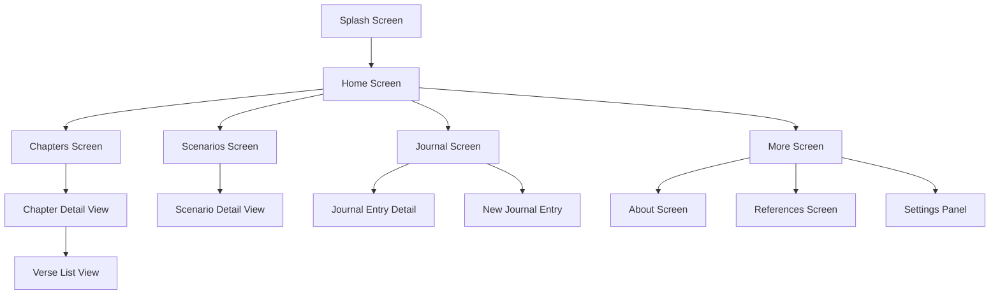

# GitaWisdom - Bhagavad Gita Guide for Modern Life

[](https://flutter.dev)
[](https://supabase.com)
[](https://dart.dev)

> **"Apply ancient Gita teachings to modern-day situations"**

A comprehensive Flutter application that brings the wisdom of the Bhagavad Gita to contemporary life through interactive chapters, real-world scenarios, daily verses, and personal journaling.

## 📱 App Overview

**GitaWisdom** transforms the 18 chapters of the Bhagavad Gita into an accessible, modern spiritual guide. Users can explore verses, apply teachings to real-life situations, and maintain a personal spiritual journal.

### ✨ Key Features

- 📖 **18 Complete Chapters**: Full Bhagavad Gita content with summaries
- 🎯 **Real-world Scenarios**: Modern applications of ancient wisdom  
- 🌅 **Daily Verses**: Random inspirational verses for daily reflection
- 📝 **Personal Journal**: Private space for spiritual reflections
- 🎨 **Dynamic Theming**: Light/Dark mode with customizable settings
- 🔤 **Typography Control**: Adjustable font sizes and text shadows
- 🎵 **Ambient Audio**: Optional background music for meditation
- 💾 **Offline Storage**: Hive-based local caching for seamless experience

## 🏗️ Architecture

### Technology Stack
- **Frontend**: Flutter 3.2.0+ with Material Design
- **Backend**: Supabase (PostgreSQL database)
- **Local Storage**: Hive for offline data and settings
- **State Management**: Provider pattern with ValueListenableBuilder
- **Typography**: Google Fonts (Poppins family)
- **Audio**: just_audio for background music
- **UI Components**: flutter_neumorphic for modern design

### Project Structure
```
lib/
├── main.dart                 # App entry point with theme configuration
├── models/                   # Data models
│   ├── chapter.dart         # Chapter model with Hive adapter
│   ├── chapter_summary.dart # Lightweight chapter overview
│   ├── verse.dart          # Individual verse model
│   ├── scenario.dart       # Real-world scenario model
│   └── journal_entry.dart  # User journal entry model
├── screens/                # UI screens
│   ├── home_screen.dart    # Main landing with daily verses
│   ├── chapters_screen.dart # Chapter list overview
│   ├── chapters_detail_view.dart # Individual chapter details
│   ├── scenarios_screen.dart # Life scenarios listing
│   ├── scenario_detail_view.dart # Scenario details with guidance
│   ├── verse_list_view.dart # Chapter verses display
│   ├── journal_screen.dart # Personal journal interface
│   ├── more_screen.dart    # Settings and app info
│   └── about_screen.dart   # App information
├── services/               # Business logic layer
│   ├── supabase_service.dart # Database operations
│   ├── settings_service.dart # User preferences (Hive)
│   ├── journal_service.dart  # Journal management
│   ├── audio_service.dart   # Background music
│   └── analytics_service.dart # Usage tracking
└── widgets/               # Reusable UI components
    ├── custom_nav_bar.dart # Bottom navigation
    └── expandable_text.dart # Text with read more/less
```

## 🔄 Application Flow Diagrams

### Main Navigation Flow


### Screen-by-Screen Flow Details

#### 🏠 **Home Screen Flow**
```
┌─────────────────────────────────────────────────────────────────────┐
│                           HOME SCREEN                               │
├─────────────────────────────────────────────────────────────────────┤
│  ┌─ Header Card ─────────────────────────────────────────────────┐  │
│  │  🏛️ "GITA WISDOM"                                             │  │
│  │  "Apply Gita Teaching to Modern Day Situations"              │  │
│  └───────────────────────────────────────────────────────────────┘  │
│                                                                     │
│  ┌─ Daily Verses Carousel ─────────────────────────────────────┐    │
│  │  📜 [Verse 1] ← → [Verse 2] ← → [Verse 3] ← → [Verse 4]    │    │
│  │     • Random verses from different chapters                  │    │
│  │     • Swipeable cards with page indicator                   │    │
│  │     • "Verse Refresher" section                            │    │
│  └─────────────────────────────────────────────────────────────┘    │
│                                                                     │
│  ┌─ Quick Access Buttons ────────────────────────────────────────┐  │
│  │  [📖 Explore Chapters] [🎯 Browse Scenarios]                 │  │
│  │  • Direct navigation to main content sections                │  │
│  └───────────────────────────────────────────────────────────────┘  │
│                                                                     │
│  🔘 Bottom Navigation: Home | Chapters | Scenarios | More          │
│  🎈 Floating Buttons: 🏠 Home | ⋯ More (Top-right corner)          │
└─────────────────────────────────────────────────────────────────────┘

User Interactions:
• Swipe verses horizontally for random spiritual guidance
• Tap "Explore Chapters" → Chapters Screen
• Tap "Browse Scenarios" → Scenarios Screen  
• Tap floating Home → Stay on Home
• Tap floating More → More Screen
• Use bottom nav for primary navigation
```

#### 📚 **Chapters Screen Flow**
```
┌─────────────────────────────────────────────────────────────────────┐
│                         CHAPTERS SCREEN                            │
├─────────────────────────────────────────────────────────────────────┤
│  ┌─ Header Card ─────────────────────────────────────────────────┐  │
│  │  📖 "GITA CHAPTERS"                                           │  │
│  │  "Immerse into the ocean of knowledge"                       │  │
│  └───────────────────────────────────────────────────────────────┘  │
│                                                                     │
│  ┌─ Chapter List (18 Chapters) ────────────────────────────────┐    │
│  │  ┌─ Chapter Card ─────────────────────────────────────────┐ │    │
│  │  │ [1] Arjuna Vishada Yoga                                 │ │    │
│  │  │     "The Despondency of Arjuna"                        │ │    │
│  │  │     Verses → 47  •  Modern Life Scenarios → 12    ➤   │ │    │
│  │  └─────────────────────────────────────────────────────────┘ │    │
│  │  ┌─ Chapter Card ─────────────────────────────────────────┐ │    │
│  │  │ [2] Sankhya Yoga                                        │ │    │
│  │  │     "The Yoga of Knowledge"                            │ │    │
│  │  │     Verses → 72  •  Modern Life Scenarios → 18    ➤   │ │    │
│  │  └─────────────────────────────────────────────────────────┘ │    │
│  │  ...continuing for all 18 chapters                            │    │
│  └─────────────────────────────────────────────────────────────────┘    │
│                                                                     │
│  🎈 Floating Buttons: ← Back | 🏠 Home (Top-right corner)           │
└─────────────────────────────────────────────────────────────────────┘

User Flow:
• Browse all 18 chapters with verse/scenario counts
• Tap any chapter card → Chapter Detail View
• Visual hierarchy: Chapter number, title, subtitle, counts
• Smooth fade transitions between screens
• Floating back button returns to previous screen
• Floating home button goes to main screen
```

#### 📖 **Chapter Detail View Flow**  
```
┌─────────────────────────────────────────────────────────────────────┐
│                      CHAPTER DETAIL VIEW                           │
├─────────────────────────────────────────────────────────────────────┤
│  ┌─ Hero Banner ─────────────────────────────────────────────────┐  │
│  │  🏛️ "Chapter {N}: {Title}"                                    │  │
│  │  📜 "{Subtitle/Description}"                                   │  │
│  │  📊 Overview: X verses, Y scenarios, key themes              │  │
│  └───────────────────────────────────────────────────────────────┘  │
│                                                                     │
│  ┌─ Navigation Tabs ─────────────────────────────────────────────┐  │
│  │  [📜 Verses] [🎯 Scenarios] [📝 Summary] [🗝️ Key Teachings] │  │
│  └───────────────────────────────────────────────────────────────┘  │
│                                                                     │
│  ┌─ Content Area (Dynamic based on tab) ───────────────────────┐    │
│  │  📜 VERSES TAB:                                              │    │
│  │     • Verse 1: "यदा यदा हि धर्मस्य..."                    │    │
│  │     • Verse 2: "Translation and commentary..."              │    │
│  │     • [View All Verses] → Verse List View                   │    │
│  │                                                              │    │
│  │  🎯 SCENARIOS TAB:                                           │    │
│  │     • "Workplace Conflict Resolution"                       │    │
│  │     • "Decision Making Under Pressure"                      │    │
│  │     • [Browse All Scenarios] → Scenarios filtered by chapter│    │
│  │                                                              │    │
│  │  📝 SUMMARY TAB:                                            │    │
│  │     • Chapter theme and core message                        │    │
│  │     • Historical context                                    │    │
│  │     • Practical applications                                │    │
│  └─────────────────────────────────────────────────────────────────┘    │
│                                                                     │
│  🎈 Floating Navigation: ← Back | 🏠 Home | ➤ Next Chapter          │
└─────────────────────────────────────────────────────────────────────┘

Navigation Paths:
• Chapter Detail → Verse List View (all chapter verses)
• Chapter Detail → Scenario Detail View (filtered scenarios)  
• Chapter Detail → Next/Previous Chapter (sequential reading)
• Tabbed interface for different content types
• Rich content with expandable sections
```

#### 🎯 **Scenarios Screen Flow**
```
┌─────────────────────────────────────────────────────────────────────┐
│                        SCENARIOS SCREEN                            │
├─────────────────────────────────────────────────────────────────────┤
│  ┌─ Header Card ─────────────────────────────────────────────────┐  │
│  │  🎯 "LIFE SCENARIOS"                                          │  │
│  │  "Apply Gita wisdom to real-world situations"                │  │
│  └───────────────────────────────────────────────────────────────┘  │
│                                                                     │
│  ┌─ Filter Bar ──────────────────────────────────────────────────┐  │
│  │  [All] [Work] [Family] [Relationships] [Stress] [Decisions]  │  │
│  │  🔍 Search scenarios by keywords or tags                      │  │
│  └───────────────────────────────────────────────────────────────┘  │
│                                                                     │
│  ┌─ Scenario List ───────────────────────────────────────────────┐  │
│  │  ┌─ Scenario Card ─────────────────────────────────────────┐ │  │
│  │  │ 💼 "Workplace Conflict Resolution"                      │ │  │
│  │  │    "When colleagues disagree on project direction..."   │ │  │
│  │  │    📖 Chapter 2: Sankhya Yoga                          │ │  │
│  │  │    🏷️ Tags: work, conflict, decision-making        ➤  │ │  │
│  │  └─────────────────────────────────────────────────────────┘ │  │
│  │  ┌─ Scenario Card ─────────────────────────────────────────┐ │  │
│  │  │ 👨‍👩‍👧‍👦 "Family Relationship Challenges"                  │ │  │
│  │  │    "Balancing personal goals with family expectations" │ │  │
│  │  │    📖 Chapter 3: Karma Yoga                           │ │  │
│  │  │    🏷️ Tags: family, duty, balance                  ➤  │ │  │
│  │  └─────────────────────────────────────────────────────────┘ │  │
│  │  ...more scenario cards with expandable descriptions          │  │
│  └─────────────────────────────────────────────────────────────────┘  │
│                                                                     │
│  🎈 Floating Buttons: 🏠 Home | ⋯ More (Top-right corner)           │
└─────────────────────────────────────────────────────────────────────┘

Features:
• Filter scenarios by category/chapter/tags
• Expandable text with "Read more" functionality  
• Chapter reference for each scenario
• Tap any scenario → Scenario Detail View with full guidance
• Search functionality for finding specific situations
```

#### 🎯 **Scenario Detail View Flow**
```
┌─────────────────────────────────────────────────────────────────────┐
│                     SCENARIO DETAIL VIEW                           │
├─────────────────────────────────────────────────────────────────────┤
│  ┌─ Hero Section ───────────────────────────────────────────────┐   │
│  │  💼 "{Scenario Title}"                                       │   │
│  │  📖 Reference: Chapter {N} - {Chapter Name}                 │   │
│  │  🏷️ Tags: [work] [conflict] [decision-making]               │   │
│  └─────────────────────────────────────────────────────────────────┘   │
│                                                                     │
│  ┌─ Situation Description ──────────────────────────────────────┐   │
│  │  📝 "Detailed description of the modern-day situation..."   │   │
│  │     • Context and background                                 │   │
│  │     • Key challenges involved                               │   │
│  │     • Emotional and practical considerations               │   │
│  └─────────────────────────────────────────────────────────────────┘   │
│                                                                     │
│  ┌─ Two-Path Guidance ──────────────────────────────────────────┐   │
│  │  ❤️ HEART RESPONSE:                                         │   │
│  │     "What your emotions/instincts might tell you to do..."  │   │
│  │     • Emotional reaction approach                           │   │
│  │     • Short-term satisfaction focus                        │   │
│  │                                                             │   │
│  │  ⚖️ DHARMA (DUTY) RESPONSE:                                │   │
│  │     "What the Gita wisdom guides you to do..."             │   │
│  │     • Dharmic action based on duty and righteousness       │   │
│  │     • Long-term perspective and greater good               │   │
│  └─────────────────────────────────────────────────────────────────┘   │
│                                                                     │
│  ┌─ Gita Wisdom & Action Steps ────────────────────────────────┐   │
│  │  📜 RELEVANT VERSE:                                         │   │
│  │     "कर्मण्येवाधिकारस्ते मा फलेषु कदाचन..."               │   │
│  │     "You have the right to action, not to its fruits..."   │   │
│  │                                                             │   │
│  │  ✅ PRACTICAL ACTION STEPS:                                │   │
│  │     1. Pause and assess the situation objectively          │   │
│  │     2. Consider duty and dharma over personal preferences   │   │
│  │     3. Act without attachment to outcomes                   │   │
│  │     4. Reflect on lessons learned                          │   │
│  └─────────────────────────────────────────────────────────────────┘   │
│                                                                     │
│  [📝 Add to Journal] [🔗 Share Wisdom] [📖 Read Full Chapter]      │
│                                                                     │
│  🎈 Floating Navigation: ← Back | 🏠 Home | 📱 More Scenarios       │
└─────────────────────────────────────────────────────────────────────┘

Key Interactions:
• Compare heart vs duty responses for balanced decision-making
• Access relevant Gita verses with modern interpretations  
• Save insights to personal journal
• Navigate to full chapter for deeper study
• Share wisdom snippets with others
```

#### 📖 **Verse List View Flow**
```
┌─────────────────────────────────────────────────────────────────────┐
│                        VERSE LIST VIEW                             │
│                     (Chapter-specific)                             │
├─────────────────────────────────────────────────────────────────────┤
│  ┌─ Chapter Header ─────────────────────────────────────────────┐   │
│  │  📖 "Chapter {N}: {Title}"                                   │   │
│  │  📊 "{X} Total Verses"                                      │   │
│  │  🔍 [Search verses] [Filter by theme]                       │   │
│  └─────────────────────────────────────────────────────────────────┘   │
│                                                                     │
│  ┌─ Verse Cards List ───────────────────────────────────────────┐   │
│  │  ┌─ Verse Card ────────────────────────────────────────────┐ │   │
│  │  │ 📜 Verse 1                                              │ │   │
│  │  │    Original: "यदा यदा हि धर्मस्य ग्लानिर्भवति भारत" │ │   │
│  │  │    Translation: "Whenever there is decline of dharma..." │ │   │
│  │  │                                                          │ │   │
│  │  │    💡 Commentary: Brief explanation                     │ │   │
│  │  │    🎯 Modern Application: Real-world relevance          │ │   │
│  │  │    [🔖 Bookmark] [📝 Add Note] [🔗 Share]              │ │   │
│  │  └──────────────────────────────────────────────────────────┘ │   │
│  │  ┌─ Verse Card ────────────────────────────────────────────┐ │   │
│  │  │ 📜 Verse 2                                              │ │   │
│  │  │    [Similar structure...]                               │ │   │
│  │  └──────────────────────────────────────────────────────────┘ │   │
│  │  ...continuing for all verses in chapter                      │   │
│  └─────────────────────────────────────────────────────────────────┘   │
│                                                                     │
│  ┌─ Reading Progress ───────────────────────────────────────────┐   │
│  │  ████████░░ 80% Complete                                    │   │
│  │  [📖 Continue Reading] [🔄 Reset Progress]                  │   │
│  └─────────────────────────────────────────────────────────────────┘   │
│                                                                     │
│  🎈 Floating Navigation: ← Back to Chapter | 🏠 Home                │
└─────────────────────────────────────────────────────────────────────┘

Features:
• Sequential verse reading with progress tracking
• Original Sanskrit with English translations
• Personal notes and bookmarking system
• Search within chapter verses
• Modern applications for each verse
```

#### 📝 **Journal Screen Flow**  
```
┌─────────────────────────────────────────────────────────────────────┐
│                         JOURNAL SCREEN                             │
├─────────────────────────────────────────────────────────────────────┤
│  ┌─ Header Card ─────────────────────────────────────────────────┐  │
│  │  📝 "SPIRITUAL JOURNAL"                                       │  │
│  │  "Reflect on your spiritual journey and insights"            │  │
│  │  [➕ New Entry] [📅 Calendar View] [🔍 Search]               │  │
│  └───────────────────────────────────────────────────────────────┘  │
│                                                                     │
│  ┌─ Entry Filters ──────────────────────────────────────────────┐  │
│  │  [All] [This Week] [This Month] [Favorites] [By Rating]     │  │
│  └───────────────────────────────────────────────────────────────┘  │
│                                                                     │
│  ┌─ Journal Entries List ───────────────────────────────────────┐  │
│  │  ┌─ Entry Card ────────────────────────────────────────────┐ │  │
│  │  │ 📅 March 15, 2024                                       │ │  │
│  │  │ 📝 "Insights on letting go of attachment..."           │ │  │
│  │  │ ⭐ Rating: ★★★★☆                                       │ │  │
│  │  │ 🎯 Related: Chapter 2 - Karma Yoga                    │ │  │
│  │  │ 📎 Tags: [attachment] [peace] [growth]            ➤   │ │  │
│  │  └──────────────────────────────────────────────────────────┘ │  │
│  │  ┌─ Entry Card ────────────────────────────────────────────┐ │  │  
│  │  │ 📅 March 10, 2024                                       │ │  │
│  │  │ 📝 "Applying dharma in difficult decisions..."         │ │  │
│  │  │ ⭐ Rating: ★★★★★                                       │ │  │
│  │  │ 🎯 Related: Workplace Scenario                         │ │  │
│  │  └──────────────────────────────────────────────────────────┘ │  │
│  │  ...more journal entries...                                   │  │
│  └─────────────────────────────────────────────────────────────────┘  │
│                                                                     │
│  📊 Quick Stats: "15 entries this month • 4.2 avg rating"          │
│                                                                     │
│  🎈 Floating Action: [➕ Quick Entry] (Bottom-right corner)         │
└─────────────────────────────────────────────────────────────────────┘

User Flow:
• Create new entries with text, ratings, and tags
• Link entries to specific chapters or scenarios  
• Search entries by content, tags, or date range
• Tap any entry → Journal Entry Detail View for full content
• Export journal data for backup/sharing
```

#### ⚙️ **More Screen (Settings) Flow**
```
┌─────────────────────────────────────────────────────────────────────┐
│                          MORE SCREEN                               │
├─────────────────────────────────────────────────────────────────────┤
│  ┌─ APPEARANCE ──────────────────────────────────────────────────┐  │
│  │  🌙 Dark Mode                                        [Toggle] │  │
│  │  🎵 Background Music                                 [Toggle] │  │
│  │  🔤 Font Size                            [Small|Medium|Large] │  │
│  │  ✨ Text Shadow                                      [Toggle] │  │
│  │  🎨 Background Opacity          [░░░░░████] 30% ←→ 100%     │  │
│  └─────────────────────────────────────────────────────────────────┘  │
│                                                                     │
│  ┌─ EXTRAS ──────────────────────────────────────────────────────┐  │
│  │  📤 Share This App                                        ➤   │  │
│  │  📱 App Version: 1.0.0                                        │  │
│  └─────────────────────────────────────────────────────────────────┘  │
│                                                                     │
│  ┌─ RESOURCES ───────────────────────────────────────────────────┐  │
│  │  ℹ️ About                                                 ➤   │  │
│  │  📚 References                                            ➤   │  │  
│  └─────────────────────────────────────────────────────────────────┘  │
│                                                                     │
│  ┌─ SUPPORT & LEGAL ─────────────────────────────────────────────┐  │
│  │  📧 Send Feedback                                         ➤   │  │
│  │  🔒 Privacy Policy                                        ➤   │  │
│  │  📜 Terms & Conditions                                    ➤   │  │
│  └─────────────────────────────────────────────────────────────────┘  │
│                                                                     │
│  🎈 Settings apply instantly with Hive persistence                 │
└─────────────────────────────────────────────────────────────────────┘

Features:
• Real-time theme switching (light/dark mode)
• Dynamic background opacity control with live preview
• Text shadow toggle for better readability  
• Font scaling with instant visual feedback
• Settings persist across app sessions
• Direct email feedback integration
```

## 🗃️ Data Flow Architecture

### Database Schema (Supabase)
```
chapters
├── ch_chapter_id (int, primary key)
├── ch_title (text)
├── ch_subtitle (text)
├── ch_summary (text)
├── ch_verse_count (int)
├── ch_theme (text)
└── ch_key_teachings (text[])

scenarios  
├── id (uuid, primary key)
├── sc_title (text)
├── sc_description (text)
├── sc_category (text)
├── sc_chapter (int, foreign key)
├── sc_heart_response (text)
├── sc_duty_response (text)
├── sc_gita_wisdom (text)
├── sc_verse (text)
├── sc_verse_number (text)
├── sc_tags (text[])
├── sc_action_steps (text[])
└── created_at (timestamp)

gita_verses
├── gv_verses_id (int, primary key)  
├── gv_verses (text)
└── gv_chapter_id (int, foreign key)

chapter_summary (view)
├── cs_chapter_id (int)
├── cs_title (text)
├── cs_subtitle (text)
├── cs_verse_count (int)
└── cs_scenario_count (int)
```

### Local Storage (Hive)
```
settings (Box)
├── isDarkMode (bool)
├── fontSize (string: 'small'|'medium'|'large')
├── music_enabled (bool)
├── text_shadow_enabled (bool)
└── background_opacity (double: 0.1-1.0)

journal_entries (Box<JournalEntry>)
├── id (string, key)
├── reflection (string)
├── rating (int: 1-5)
└── dateCreated (DateTime)

chapters (Box<Chapter>) - Cached from Supabase
├── chapterId (int, key)
├── title, subtitle, summary
├── verseCount, theme
└── keyTeachings (List<String>)
```

## 🚀 Getting Started

### Prerequisites
- Flutter SDK 3.2.0+
- Dart 2.18.0+
- Android Studio / VS Code
- iOS/Android device or emulator

### Installation

1. **Clone the repository**
   ```bash
   git clone <repository-url>
   cd GitaWisdom
   ```

2. **Install dependencies**
   ```bash
   flutter pub get
   ```

3. **Generate Hive adapters**
   ```bash
   flutter packages pub run build_runner build
   ```

4. **Configure Supabase**
   - Update `lib/main.dart` with your Supabase URL and anon key
   - Import database schema from `/supabase` folder

5. **Run the application**
   ```bash
   flutter run
   ```

### Build for Production
```bash
# Android
flutter build apk --release

# iOS  
flutter build ios --release
```

## 🧪 Testing

### Test Structure
```
test/
├── models/              # Model unit tests
├── services/            # Service layer tests  
├── screens/             # Widget tests for screens
├── utils/               # Test utilities and helpers
└── integration_test/    # End-to-end tests
```

### Run Tests
```bash
# Unit tests
flutter test

# Integration tests  
flutter test integration_test/
```

## 📱 Platform Support

- ✅ **Android** 7.0+ (API level 24+)
- ✅ **iOS** 11.0+  
- ✅ **Web** (Progressive Web App ready)
- ✅ **Desktop** (Windows, macOS, Linux)

## 🤝 Contributing

1. Fork the repository
2. Create a feature branch (`git checkout -b feature/amazing-feature`)
3. Commit changes (`git commit -m 'Add amazing feature'`)
4. Push to branch (`git push origin feature/amazing-feature`)
5. Open a Pull Request

### Code Style
- Follow [Dart Style Guide](https://dart.dev/guides/language/effective-dart/style)
- Use meaningful commit messages
- Add tests for new features
- Update documentation as needed

## 📄 License

This project is licensed under the MIT License - see the [LICENSE](LICENSE) file for details.

## 🙏 Acknowledgments

- **Bhagavad Gita** - The eternal source of wisdom
- **A.C. Bhaktivedanta Swami Prabhupada** - "Bhagavad-gītā As It Is" translation
- **Flutter Team** - Amazing cross-platform framework
- **Supabase** - Backend-as-a-Service platform
- **Google Fonts** - Beautiful typography options

## 📞 Support

- **Email**: support@gitawisdom.app
- **Website**: [https://gitawisdom.app](https://gitawisdom.app)  
- **Issues**: [GitHub Issues](https://github.com/your-username/GitaWisdom/issues)

---

> *"You have the right to perform your actions, but you are not entitled to the fruits of action."* - Bhagavad Gita 2.47

**Made with ❤️ for spiritual seekers everywhere**